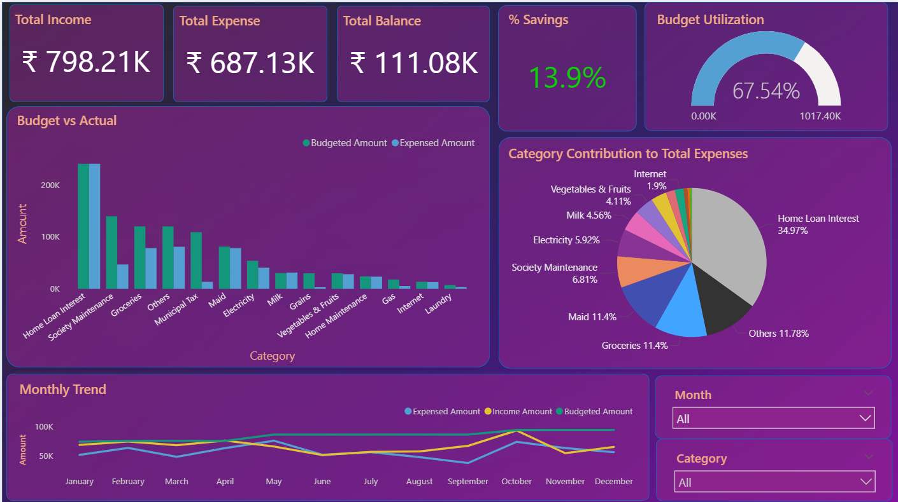

# Family-Expenses-Tracker-Dashboard-Excel-Power-BI
Personal Finance &amp; Monthly Expense Tracking Dashboard built using Power BI to analyze income, expenses, budget utilization, savings trends, and category-wise spending insights through interactive visualizations and slicers.

## 📊 Project Overview
This project is a Power BI dashboard created to track and analyze monthly family finances.
The dashboard helps monitor:
- Monthly income
- Category-wise expenses
- Budget vs actual spending
- Savings trends
- Budget utilization
- Expense distribution patterns
The report uses interactive visuals, slicers, KPIs, and DAX measures to provide actionable financial insights.

## 🎯 Objectives
- Track monthly income and expenses
- Compare actual expenses against planned budget
- Identify overspending categories
- Monitor savings and budget utilization
- Analyze spending trends over time
- Build an interactive and user-friendly financial dashboard

## Dataset
👉 [View Dataset](./Family_Expenses_25.xlsx)

## ⚙️ Process
### 🔷 Data Collection & Preparation
  - Created separate datasets for Budget, Income, and Expenses tracking.
  - Cleaned and structured the data using Power Query.
  - Standardized category names and month values for accurate analysis and filtering.
### 🔷 Data Modeling
  - Built relationships between tables using a common Category dimension table.
  - Implemented a star schema model to enable efficient filtering and interaction across visuals.
  - Established proper relationships between Budget, Expenses, and Category tables.
### 🔷 DAX Measure Creation
  Developed dynamic DAX measures for:
  - Total Income
  - Total Expenses
  - Savings Calculation
  - Budget Utilization %
  - Budget vs Actual - Variance
  - Remaining Budget
  These measures enabled real-time calculations based on slicer selections and filters.
### 🔷 Dashboard Development
  Designed an interactive dashboard using:
  - KPI Cards
  - Gauge Chart
  - Pie/Donut Charts
  - Line Charts
  - Variance Analysis Charts
  - Detailed Expense Tables
  Implemented slicers for: Month, Category to provide dynamic and user-driven analysis.

### 🔷 Data Visualization & Insights
  - Applied conditional formatting to highlight overspending categories.
  - Used interactive visuals to analyze spending behavior and savings trends.
  - Created budget tracking visuals to compare planned vs actual expenses.

## Dashboard: Family Expenses-2025 Dashboard

## 🛠️ Tools & Technologies Used
- Microsoft Excel
- Microsoft Power BI
- Power Query
- DAX (Data Analysis Expressions)
- Data Modeling
- Interactive Dashboard Design

## 🔍 Insights Derived
- Identified highest spending categories
- Tracked monthly savings trend
- Compared planned vs actual expenses
- Analyzed budget utilization efficiency
- Detected overspending patterns

## ✅ Conclusion
The Family Expense Tracker Dashboard provides an interactive solution for monitoring income, expenses, savings, and budget utilization. The project demonstrates practical experience in data modeling, DAX, and dashboard development using Microsoft Power BI while delivering actionable financial insights through dynamic visualizations and analysis.
